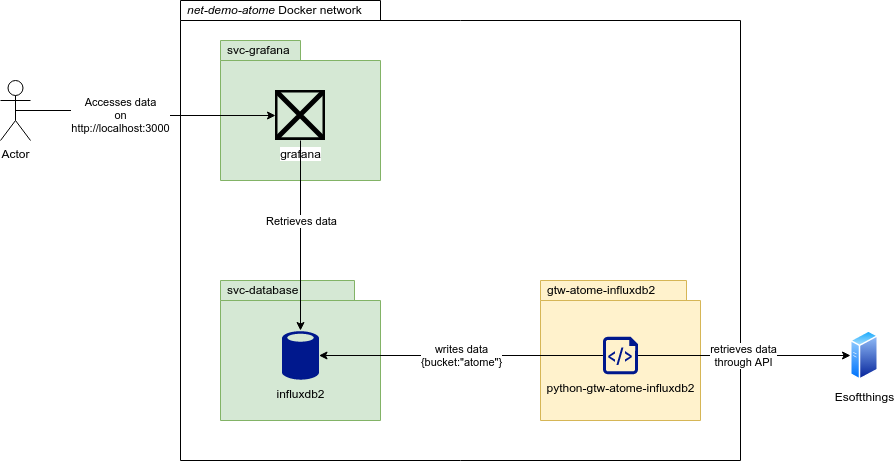

# Python client to retrieve Atome data

## Introduction

_Atome_ is an IoT object privided by Total Energies that connects to _Linky_
power meters. It provides real-time data about power consumtion by reading on
the _TIC_ output (télé-information client) of the power meter,
then transmits them through WiFi to an online service provider (_Esoftthings_).

This repository holds a Python client that retrieves _Atome_ data from the
ESoftthings API and outputs them as
[InfluxDB's Line Protocol](https://docs.influxdata.com/influxdb/cloud/reference/syntax/line-protocol/)
measurements.

It also embeds a demonstration project based on Docker.

## Usage

### Run the demo

This repository contains a `demo` directory where a Docker project sets up
a minimal working example to collect and visualize data.
Below is an architecture diagram of the demo project:

It contains the following containers on the local `net-demo-atome` Docker
network:
+ `gtw-atome-influxdb2`: The Python client embedded into a container.
  It collects data and writes it to the `svc-database` InfluxDB database.
+ `svc-database`: An instance of InfluxDB v2 to store collected data.
+ `svc-grafana`: An instance of Grafana with provisioned dashboards to visualize
  collected Atome data.

Clients can visualize the data through Grafana by accessing
http://localhost:3000 .
Default Grafana credentials are `username`/`password` and can be changed before
the first start by editing the `SVC_GRAFANA_ADMIN_USER` and
`SVC_GRAFANA_ADMIN_PASSWORD` variables from the
[./demo/variables.sh](./demo/variables.sh) file.

### Pre-requisites

This procedure has been tested on a Linux `Ubuntu 20.04 LTS`,
but might work with other Linux Flavors.

You need to have the Docker Engine installed on your system
(see Docker docs for [for Ubuntu](https://docs.docker.com/engine/install/ubuntu/)).

### Deploy the Docker stack

For convenience, everything should work out-of-the-box by running a single
script.
If you want to edit the initial setup (Grafana credentials, Docker network name,
persistent data directory, ...) just edit the corresponding variable in the
[./demo/variables.sh](./demo/variables.sh) file before running anything.

~~~~~{sh}
# Clone the repository and get into the demo directory
git clone python-gtw-atome-influxdb2
cd python-gtw-atome-influxdb2/demo

# Optional: Edit the initial configuration
# vim variables.sh

# Start the Docker stack
# On the first run, it will open two dialog boxes asking for
# your Atome credentials. These are the ones you use to connect to the Atome
# app. They will be stored locally in a `.config.ini` file.
bash run.sh

# Once the script has finished, you should have access to the
# Grafana interface at http://localhost:3000
~~~~~

### Stop the Docker stack and remove persistent data

You can either _clean_ your environment (remove all Docker-related elements from
your system) or _flush_ it (also remove persistent data).

The two scripts are available in the [demo/](demo/) folder.
~~~~~{sh}
cd demo/

# Remove Docker containers and network
./clean.sh

# Remove Docker elements AND persistent data
./flush.sh
# This script will ask for confirmation.
~~~~~

### Run from the sources

[TODO]

## References and aknowledgements

The content of this repository is heavily based on the work of:
+ [k20human](https://github.com/k20human/domoticz-atome)
+ [XciD](https://gist.github.com/XciD/cdb02ed7725a3a64cca126ffdd04d0ed)

Many thanks to them for making the world more OpenSource.
